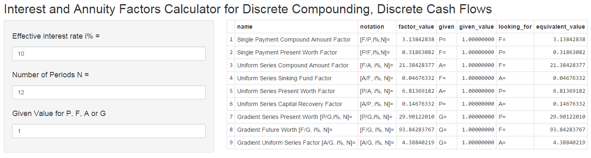

#Engineering Economics Tools Built With [R] and RShiny

Code in [R] and Widgets made in RShiny used for making economic and/or financial decisions in engineering/businss projects

1) Interest and Annuity Factors Calculator for Discrete Compounding, Discrete Cash Flows

